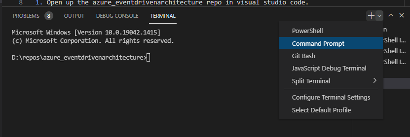

# Setup Policies

In this section we will create policies on our new estate to ensure that team tagging is in place appropriately.

**You must have all the pre-requisites completed before carrying out the below.**

1. Open up the azure_eventdrivenarchitecture repo in visual studio code.

2. Open up the Terminal by going to view > terminal in the visual studio code menu.

3. Ensure that command prompt is chosen in the right of the terminal.



4. Login to Azure running the Azure CLI command below in the terminal.

```bash
az login
```

5. Set the azure subscription you are going to be using by running the command below in the terminal. The %AZURE_SUBSCRIPTION% will come from the value you have placed in your environment variables as part of the pre-requisites.

```bash
az account set --subscription "%AZURE_SUBSCRIPTION%"
```

6. Assign the built-in policy to ensure only appropriate locations are allowed.

```ps1
$subscription = [System.Environment]::GetEnvironmentVariable("AZURE_SUBSCRIPTION") 
$subscriptionId = (Get-AzSubscription -SubscriptionName $subscription).id
$Policy = Get-AzPolicyDefinition -BuiltIn | Where-Object {$_.Properties.DisplayName -eq "Allowed locations"}
$Locations = Get-AzLocation | where {($_.displayname -like "*europe") -or ($_.displayname -like "uk*")}
$locations
$AllowedLocations = @{"listOfAllowedLocations"=($Locations.location)}
New-AzPolicyAssignment -Name "RestrictLocationPolicyAssignment" -PolicyDefinition $Policy -Scope "/subscriptions/${subscriptionId}" -PolicyParameterObject $AllowedLocations
```

7. Assign the built-in policy to ensure that resource groups have to have a team tag.

```ps1
$subscription = [System.Environment]::GetEnvironmentVariable("AZURE_SUBSCRIPTION") 
$subscriptionId = (Get-AzSubscription -SubscriptionName $subscription).id
$Policy = Get-AzPolicyDefinition -BuiltIn | Where-Object {$_.Properties.DisplayName -eq "Require a tag on resource groups"}
$tagName = "team"
$teamTag = @{"tagName"=$tagName}
New-AzPolicyAssignment -Name "TeamTagRequiredResourceGroupPolicyAssignment" -PolicyDefinition $Policy -Scope "/subscriptions/${subscriptionId}" -PolicyParameterObject $teamTag
```
8. Assign the built-in policy to ensure that resources have to have a team tag.

```ps1
$subscription = [System.Environment]::GetEnvironmentVariable("AZURE_SUBSCRIPTION") 
$subscriptionId = (Get-AzSubscription -SubscriptionName $subscription).id
$Policy = Get-AzPolicyDefinition -BuiltIn | Where-Object {$_.Properties.DisplayName -eq "Require a tag on resources"}
$tagName = "team"
$teamTag = @{"tagName"=$tagName}
New-AzPolicyAssignment -Name "TeamTagRequiredResourcePolicyAssignment" -PolicyDefinition $Policy -Scope "/subscriptions/${subscriptionId}" -PolicyParameterObject $teamTag
```

8. Create a custom policy to ensure that resource group team tag values are from an appropriate list.

```ps1
$location = [System.Environment]::GetEnvironmentVariable("AZURE_REGION")
New-AzSubscriptionDeployment `
  -Name eventPolicyResourceGroup `
  -Location $location  `
  -TemplateFile 01_Platform\01_Policies\bicep\policyTeamTagResourceGroups.bicep
```

9. Assign the custom policy to ensure that resource groups have a valid team tag value.

```ps1
$subscription = [System.Environment]::GetEnvironmentVariable("AZURE_SUBSCRIPTION") 
$subscriptionId = (Get-AzSubscription -SubscriptionName $subscription).id
$Policy = Get-AzPolicyDefinition -Custom | Where-Object {$_.Properties.DisplayName -eq "Deny deployment of resource group if tag values are not in given list"}
New-AzPolicyAssignment -Name "TeamTagValueDenyResourceGroupPolicyAssignment" `
-PolicyDefinition $Policy `
-Scope "/subscriptions/${subscriptionId}" `
-PolicyParameter 01_Platform\01_Policies\AllowedTeams.json
```

10. Create a custom policy to ensure that resources team tag values are from an appropriate list.

```ps1
$location = [System.Environment]::GetEnvironmentVariable("AZURE_REGION")
New-AzSubscriptionDeployment `
  -Name eventPolicyResourceGroup `
  -Location $location  `
  -TemplateFile 01_Platform\01_Policies\bicep\policyTeamTagResources.bicep
```

11. Assign the custom policy to ensure that resource groups have a valid team tag value.

```ps1
$subscription = [System.Environment]::GetEnvironmentVariable("AZURE_SUBSCRIPTION") 
$subscriptionId = (Get-AzSubscription -SubscriptionName $subscription).id
$Policy = Get-AzPolicyDefinition -Custom | Where-Object {$_.Properties.DisplayName -eq "Deny deployment of resource if tag values are not in given list"}
New-AzPolicyAssignment -Name "TeamTagValueDenyResourcePolicyAssignment" `
-PolicyDefinition $Policy `
-Scope "/subscriptions/${subscriptionId}" `
-PolicyParameter 01_Platform\01_Policies\AllowedTeams.json
```