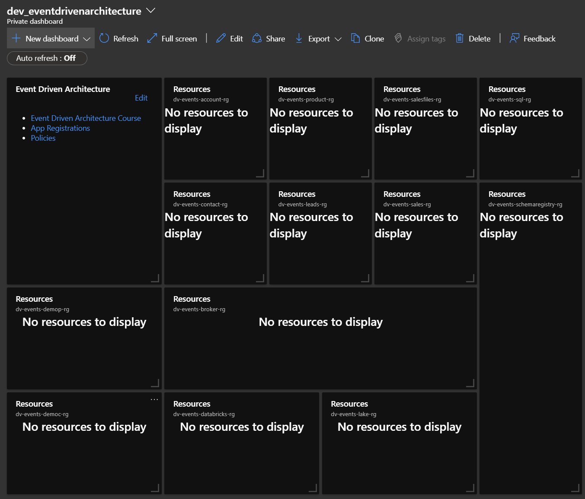

# Setup Resource Groups

In this section we will create the resource group shell of our estate using bicep and then create an azure dashboard displaying all the components.
The resource groups would normally be deployed by the respective teams (platform, customer, product and sales) but doing this for the workshop simply makes the estate easier to navigate from the offset.

If you ever need to quickly cleanup the entire estate and remove all the resource groups and resource, please use the script and instructions found [here](./cleanup.ps1).

**You must have all the [pre-requisites](/Prerequisites.md) completed before carrying out the below.**

1. Open up the azure_eventdrivenarchitecture repo in visual studio code.

2. Open up the Terminal by going to view > terminal in the visual studio code menu.

3. Ensure that command prompt is chosen in the right of the terminal.


4. Login to Azure running the Azure CLI command below in the terminal.

```bash
az login
```

5. Set the azure subscription you are going to be using by running the command below in the terminal. The %AZURE_SUBSCRIPTION% will come from the value you have placed in your environment variables as part of the pre-requisites.

```bash
az account set --subscription "%AZURE_SUBSCRIPTION%"
```

6. Deploy the resource groups for the architecture by running he command below in the terminal. The %AZURE_REGION% will come from the value you have placed in your environment variables as part of the pre-requisites.

```bash
az deployment sub create --name eventResourceGroups --location "%AZURE_REGION%" --template-file 01_Platform\02_ResourceGroups\bicep\resourcegroups.bicep
```

7. If you navigate to your dashboard now, created as part of your [pre-requisites](/Prerequisites.md), you should see all the resource groups present.

* dv-events-schemaregistry-rg (team: platform)
* dv-events-broker-rg (team: platform)
* dv-events-databricks-rg (team: platform)
* dv-events-lake-rg (team: platform)
* dv-events-sql-rg (team: platform)
* dv-events-product-rg (team: product)
* dv-events-account-rg (team: customer)
* dv-events-contact-rg (team: customer)
* dv-events-leads-rg (team: conversions)
* dv-events-salesfiles-rg (team: conversions)
* dv-events-sales-rg (team: conversions)



8. To confirm tags, click on a resource group and you should see the team tag at the top of the page.


**Note:** You will also see a democ and demop resource group tile that is currently empty. This is used as part of a quickstart demo and will only be short-lived and not part of the overall architecture, but it makes it easier to discover by being on the dashboard.
