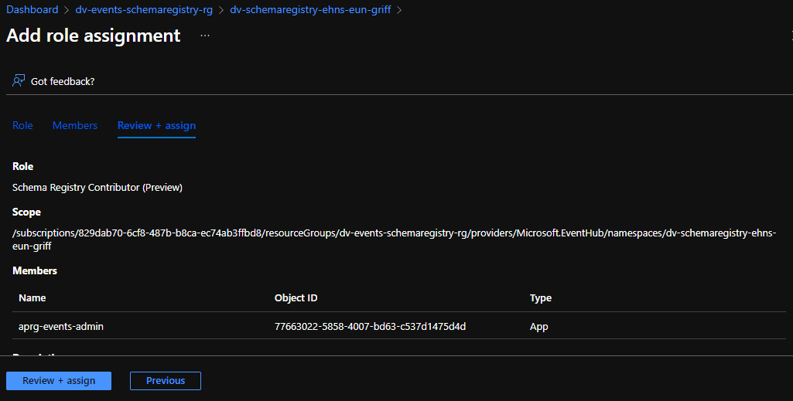
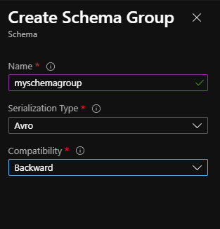
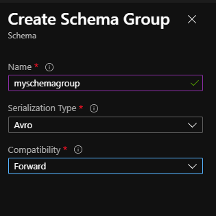

# Experiment with Schema Registry

In this section we are just going to explore some registry concepts and implementation before we carry on as the value stream teams using our new shared components of the event driven architecture!

For this section you will need to make sure you have python installed as per the pre-requisites.

**You must have completed [02_SharedPlatform](../02_SharedInfrastructure/ReadMe.md) and [prerequisites](../../Prerequisites.md) before continuing with the below.**
## Grant the Admin App Reg Permissions on Schema Registry

Might be a delay after added before works.



## Create a Python Environment

1. Open your Visual Studio code terminal.
2. Run the following to create a virtual environment called venv.

```py
python -m venv venv
```

**Important Note** : We will be using a single virtual environment for this entire implementation, but remember we are actually imitating a number of teams so the environment should actually be split per each teams implementation and what packages and dependencies they need along to carry out their function.

1. Activate the python environment by running the following.

```py
venv\scripts\activate
```

## Create a Backward Compatible Schema Group and Schemas

We are first going to demonstrate a backward compatible schema in the schema registry. A backwards compatible schema ensures that readers on new versions of schemas can consume older versions of schemas that are published.  Schema compatibility is described in more detail in this blog post [here]([Compatibility](https://stevenheidel.medium.com/backward-vs-forward-compatibility-9c03c3db15c9#:~:text=Backward%20compatibility%20means%20that%20readers,writers%20with%20a%20newer%20schema.)
).

1. Navigate to your schema registry event hub namespace in the Azure portal (dv-schemaregistry-ehns-eun-{youruniqueid}).
1. Under entities on the left hand side menu choose "Schema Registry".
2. Select +Schema Group.


3. Call the schema group "myschemagroup", leave serialization type as avro, and choose **backward** compatibility.




4. Look at the code in this file [register_schemas_backward](./register_schemas_backward.py). This is going to upload the schemas present in the script and there are comments on why some will succed and some will not based on backward compatible schemas as per the schema registry [documentation](https://docs.microsoft.com/en-us/azure/event-hubs/schema-registry-overview#backward-compatibility).
5. Now execute the below in the terminal, replacing {youruniquenamespace} with your unique value first.

```
01_Platform\03_SchemaRegistry\register_schemas_backward.py dv-schemaregistry-ehns-eun-{youruniquenamespace}.servicebus.windows.net
```

1. We will see in the terminal output that schema attempts 1, 2 and 4 were able to be uploaded bu schemas 3 and 5 were not.

* Schema 1 was the initiali schema and valid so uploaded fine.
* Schema 2 added an optional field which is a valid backward compatible change to make so uploaded fine.
* Schema 3 added a mandatory field which is an invalid backward compatible change to make so did not upload.
* Schema 4 removed a field which is a a valid backward compatible change to make so uploaded fine.
* Schema 5 attempted to rename a mandatory field which is an invalid backward compatible change to make so did not upload.

2. Delete the schema group "myschemagroup". We will be creating a forward compatible schema group in the next exercise. **Note**: Standard event hub namespaces only allow for a single schema group per namespace, but premium namspaces allow for up to 100. You can see more on event hub quotas [here](https://docs.microsoft.com/en-us/azure/event-hubs/event-hubs-quotas).

## Create a Forward Compatible Schema Group and Schemas

We are now going to demonstrate a forward compatible schema in the schema registry. A forward compatible schema ensures that new schema from publishers can be read by consumers on previous schema versions.  Schema compatibility is described in more detail in this blog post [here]([Compatibility](https://stevenheidel.medium.com/backward-vs-forward-compatibility-9c03c3db15c9#:~:text=Backward%20compatibility%20means%20that%20readers,writers%20with%20a%20newer%20schema.)
).

1. Navigate to your schema registry event hub namespace in the Azure portal (schemaregistry-ehns-eun-{youruniqueid}).
1. Under entities on the left hand side menu choose "Schema Registry".
2. Select +Schema Group.


3. Call the schema group "myschemagroup", leave serialization type as avro, and choose **forward** compatibility.




4. Look at the code in this file [register_schemas_forward](./register_schemas_forward.py). This is going to upload the schemas present in the script and there are comments on why some will succed and some will not based on backward compatible schemas as per the schema registry [documentation](https://docs.microsoft.com/en-us/azure/event-hubs/schema-registry-overview#forward-compatibility).
5. Now execute the below in the terminal.

```
01_Platform\03_SchemaRegistry\register_schemas_forward.py dv-schemaregistry-ehns-eun-{youruniquenamespace}.servicebus.windows.net
```

1. We will see in the terminal output that schema attempts 1, 2 and 3 were able to be uploaded but schemas 4 and 5 were not.

* Schema 1 was the initial schema and valid so uploaded fine.
* Schema 2 added an optional field which is a valid forward compatible change to make so uploaded fine.
* Schema 3 added a mandatory field which is a valid forward compatible change to make so uploaded fine.
* Schema 4 removed a field which is a an invalid forward compatible change to make so did not upload.
* Schema 5 attempted to rename a mandatory field which is an invalid forward compatible change to make so did not upload.

1. Deactive your python environment by executing the following in your terminal:

```bash
venv\scripts\deactivate
```
