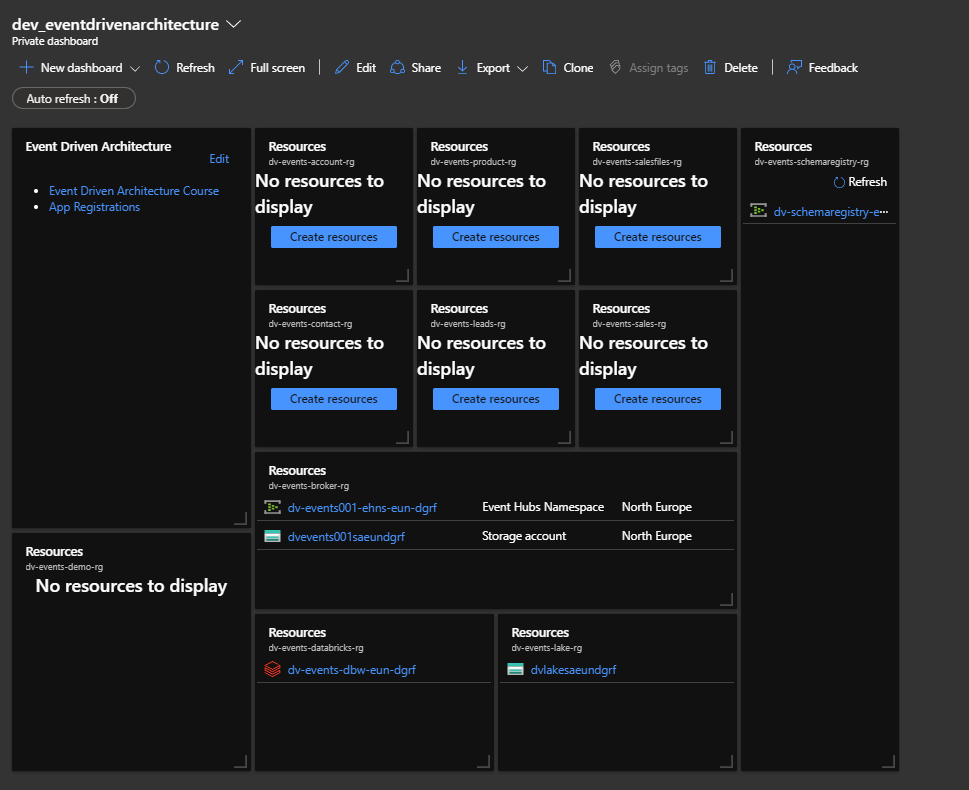

# Setup Shared Platform

In this section we will be taking the role of the Platform team and deploying all the shared resources for the event driven architecture.

**You must have completed [01_ResourceGroups](../01_ResourceGroups/ReadMe.md) before continuing with the below.**

1. Open up the azure_eventdrivenarchitecture repo in visual studio code.

2. Open up the Terminal by going to view > terminal in the visual studio code menu.

3. Ensure that command prompt is chosen on the right dropdown menu of the terminal.


4. Login to Azure running the Azure CLI command below in the terminal.

```bash
az login
```

5. Set the azure subscription you are going to be using by running the command below in the terminal. The %AZURE_SUBSCRIPTION% will come from the value you have placed in your environment variables as part of the pre-requisites.

```bash
az account set --subscription "%AZURE_SUBSCRIPTION%"
```

6. Deploy the **schema registry** shared infrastructure by running the following command in the terminal. The %AZURE_UNIQUE_NAMESPACE% will come from the value you have placed in your environment variables as part of the pre-requisites.
Once deployed confirm you can see the event hub namespace **dv-schemaregistry-ehns-eun-%AZURE_UNIQUE_NAMESPACE%** in the portal in the **dv-events-schemaregistry-rg** resource group. You should also the resource is tagged with team: platform.

```bash
az deployment group create --name "schemaRegistryDeployment" --resource-group "dv-events-schemaregistry-rg" --template-file "01_Platform\03_SharedInfrastructure\bicep\schemaregistry.bicep" --parameters namespace="%AZURE_UNIQUE_NAMESPACE%"
```

**Note** - this schema registry could be a part of the event broker namespace itself, we have just kept it separate for now to show scalability and to highlight it as a key component on the estate.

7. Deploy the **event broker** shared infrastructure by running the following command in the terminal. The %AZURE_UNIQUE_NAMESPACE% will come from the value you have placed in your environment variables as part of the pre-requisites.
Once deployed confirm you can see the event hub namespace **dv-events001-ehns-eun-%AZURE_UNIQUE_NAMESPACE%** and storage account **dvevents001saeun%AZURE_UNIQUE_NAMESPACE%** in the portal in the **dv-events-broker-rg** resource group. You should also the resource is tagged with team: platform.

```bash
az deployment group create --name "brokerDeployment" --resource-group "dv-events-broker-rg" --template-file "01_Platform\03_SharedInfrastructure\bicep\broker.bicep" --parameters namespace="%AZURE_UNIQUE_NAMESPACE%"
```

8. Deploy the **data lake** shared infrastructure by running the following command in the terminal. The %AZURE_UNIQUE_NAMESPACE% will come from the value you have placed in your environment variables as part of the pre-requisites.
Once deployed confirm you can see the data lake storage account **dvlakesaeun%AZURE_UNIQUE_NAMESPACE%** in the portal in the **dv-events-lake-rg** resource group. You should also the resource is tagged with team: platform.

```bash
az deployment group create --name "lakeDeployment" --resource-group "dv-events-lake-rg" --template-file "01_Platform\03_SharedInfrastructure\bicep\lake.bicep" --parameters namespace="%AZURE_UNIQUE_NAMESPACE%"
```

1. Deploy the **databricks** shared infrastructure by running the following command in the terminal. The %AZURE_UNIQUE_NAMESPACE% will come from the value you have placed in your environment variables as part of the pre-requisites.
Once deployed confirm you can see the data lake storage account **dv-events-dbw-eun-"%AZURE_UNIQUE_NAMESPACE%"** in the portal in the **dv-events-databricks-rg** resource group. You should also the resource is tagged with team: platform.

```bash
az deployment group create --name "databricksDeployment" --resource-group "dv-events-databricks-rg" --template-file "01_Platform\03_SharedInfrastructure\bicep\databricks.bicep" --parameters namespace="%AZURE_UNIQUE_NAMESPACE%"
```

10. You have now played the role of the platform team and deployed all the shared assets for the business value teams to utilize.

